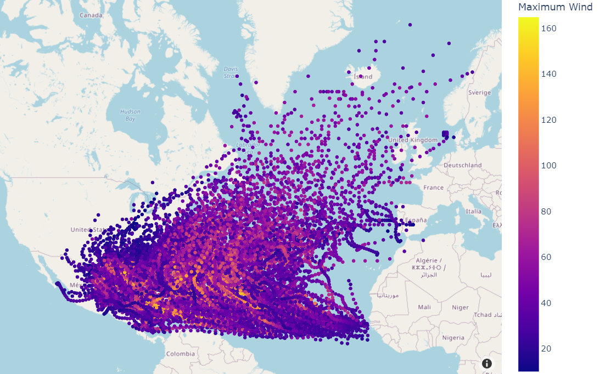

This submodule contains a notebook which provides 6h forecasts of the next positions of hurricanes in the Atlantic Ocean. Taking into account the motion history of the hurricanes recorded up to that point as well as their current properties, feature sets are created that are then used to train and evaluate a suite of machine learning models including a random forest regressor, support vector machine and a multi layer perceptron.

